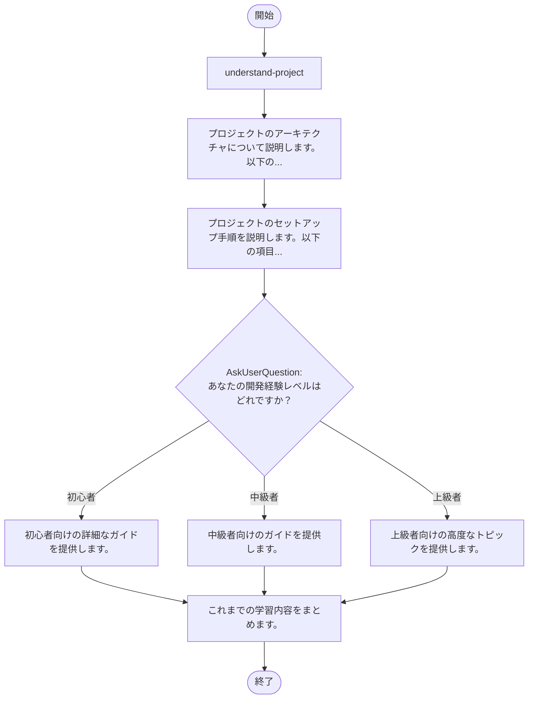

## ワークフロー実行ガイド

上記のMermaidフローチャートに従ってワークフローを実行してください。各ノードタイプの実行方法は以下の通りです。

### ノードタイプ別実行方法

- **四角形のノード**: Taskツールを使用してSub-Agentを実行します
- **ひし形のノード(AskUserQuestion:...)**: AskUserQuestionツールを使用してユーザーに質問し、回答に応じて分岐します
- **ひし形のノード(Branch/Switch:...)**: 前処理の結果に応じて自動的に分岐します(詳細セクション参照)
- **四角形のノード(Promptノード)**: 以下の詳細セクションに記載されたプロンプトを実行します

### Promptノード詳細

#### explain_architecture(プロジェクトのアーキテクチャについて説明します。以下の...)

```
プロジェクトのアーキテクチャについて説明します。以下の観点から詳しく説明してください：

1. **全体的な構成**: レイヤー、モジュール、コンポーネント構成
2. **データフロー**: データがシステム内をどのように流れるか
3. **主要な技術スタック**: 使用している言語、フレームワーク、ライブラリ
4. **スケーラビリティ**: システムがどのようにスケールするか
5. **セキュリティ考慮事項**: 実装されたセキュリティ対策

次のステップに進む準備ができました。
```

#### setup_guide(プロジェクトのセットアップ手順を説明します。以下の項目...)

```
プロジェクトのセットアップ手順を説明します。以下の項目をカバーしています：

1. **前提条件**: 必要なソフトウェアとバージョン
2. **インストール**: 依存関係のインストール方法
3. **設定**: 環境変数やコンフィグファイルの設定
4. **初期化**: プロジェクトの初期化コマンド
5. **動作確認**: セットアップが成功したことを確認する方法

あなたの経験レベルに合わせたガイドを次のステップで提供します。
```

#### guide_beginner(初心者向けの詳細なガイドを提供します。)

```
初心者向けの詳細なガイドを提供します。

## はじめに
このプロジェクトを初心者向けに解説します。以下をステップバイステップで説明します：

### 1. 基本概念
- プロジェクトの核となる概念
- 使用している主要なライブラリの役割

### 2. プロジェクト構造
```
主要なディレクトリ構造と各ファイルの役割
```

### 3. 最初のステップ
- 簡単な例から始める
- 基本的な機能を試す

### 4. よくある質問
- 初心者がつまずきやすいポイント
- 解決方法

### 5. 次のステップ
- より高度な機能への進み方

質問やわからないことがあれば、遠慮なくお聞きください。
```

#### guide_intermediate(中級者向けのガイドを提供します。)

```
中級者向けのガイドを提供します。

## 開発の進め方
あなたの経験を活かしたプロジェクト開発のポイント：

### 1. プロジェクト構造の理解
- 各モジュールの責務
- 依存関係とインタフェース

### 2. 開発ワークフロー
- 推奨される開発手順
- ブランチ戦略とコミット慣例

### 3. テスト戦略
- ユニットテストの書き方
- 統合テストのポイント

### 4. パフォーマンス最適化
- ボトルネックの特定方法
- 最適化のベストプラクティス

### 5. 実装のベストプラクティス
- コード品質の維持
- 保守性を高めるテクニック

さらに詳しい内容が必要でしたら、お知らせください。
```

#### guide_advanced(上級者向けの高度なトピックを提供します。)

```
上級者向けの高度なトピックを提供します。

## アドバンストなテーマ
深い知識をお持ちの方向けの内容です：

### 1. アーキテクチャ設計の詳細
- システム設計の哲学
- スケーラビリティとメンテナンス性

### 2. 高度な最適化
- マイクロアーキテクチャレベルの最適化
- リソース効率の最大化

### 3. セキュリティ実装
- セキュアなコーディング実践
- 脅威モデリングと対策

### 4. 拡張性
- プラグインシステムの設計
- カスタム拡張の実装

### 5. 運用と保守
- モニタリングとロギング戦略
- デプロイメント自動化

### 6. コントリビューション
- プロジェクトへの貢献方法
- コードレビュープロセス

詳細な技術的なご質問があればお答えします。
```

#### consolidate_learning(これまでの学習内容をまとめます。)

```
これまでの学習内容をまとめます。

## 学習内容の確認

あなたの経験レベルに合わせて、以下の内容をカバーしました：

### 提供したガイダンス
1. プロジェクトの全体構造と目的
2. アーキテクチャの詳細な説明
3. セットアップと初期設定
4. あなたのレベルに合わせた具体的なガイド

### 次のアクション
- セットアップ手順に従ってプロジェクトをセットアップする
- 提供されたガイドに従って開発を開始する
- わからないことや問題が発生したら質問する

### リソース
- ドキュメント
- コード例
- トラブルシューティングガイド

プロジェクトの開発を始める準備ができました。成功をお祈りします！
```

### AskUserQuestionノード詳細

#### ask_experience(あなたの開発経験レベルはどれですか？)

**選択モード:** 単一選択(選択された選択肢に応じて分岐します)

**選択肢:**
- **初心者**: このタイプのプロジェクトは初めてです
- **中級者**: 同様のプロジェクトの経験があります
- **上級者**: この分野での深い経験があります
